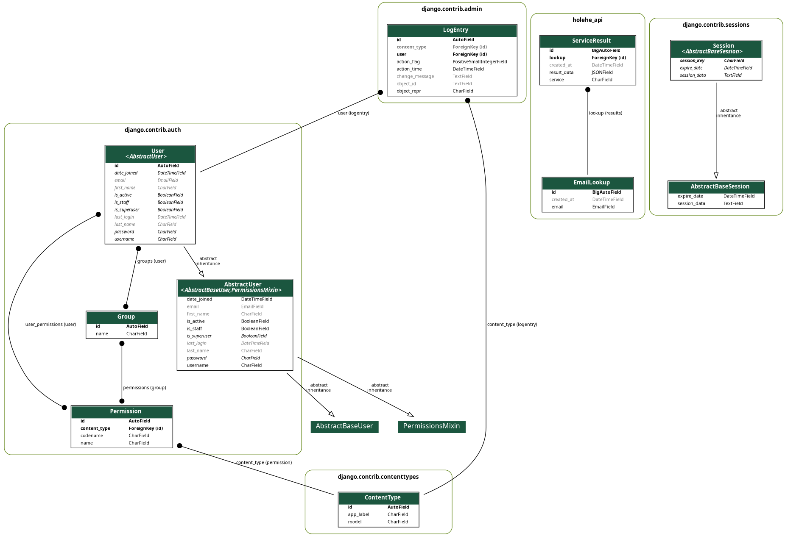

# API de Verificación de Correos Electrónicos en Redes Sociales 🔍 

## Descripción del Proyecto

Este proyecto es una API REST desarrollada con **Django REST Framework** que permite verificar si una dirección de correo electrónico está registrada en diferentes redes sociales. Utiliza la librería **Holehe** para realizar las búsquedas de manera automatizada y devuelve los resultados en un formato estructurado.

## Diagrama de Modelos



## Funcionalidades principales:

- 💾 **Base de datos local:**
  Los resultados de las búsquedas se almacenan en la base de datos para evitar búsquedas duplicadas.


- 📁 **Endpoints disponibles:**
  - `/api/holehe/?email=example@mail.com` → Busca el correo en los resultados ya guardados o realiza una nueva búsqueda si no existe.

---

## Objetivo

Este sistema está pensado como una herramienta útil para analistas de OSINT (Open Source Intelligence) para recolectar información sobre una dirección de correo electrónico y determinar si está asociada a cuentas en redes sociales. Esto ayuda a crear un perfil digital de un objetivo (por ejemplo, en investigaciones sobre amenazas, fraudes, suplantación de identidad o personas desaparecidas).


#### Documentación de Endpoints Públicos API Holehe

1. Endpoint: `/api/holehe/emails/` - `GET`
Descripción: Permite buscar información de un email en la base de datos local. Si el email no existe, consulta todos los servicios usando la integración con Holehe, guarda los resultados y los retorna.

#### Parámetros:

**Nombre**: email
**Tipo**: string
**Descripción**: Email que se desea consultar
**Obligatorio**: Sí

### Ejemplo de solicitud:

`GET /api/holehe?email=test@gmail.com`
Ejemplo de respuesta (`200 OK`):

```json
[
  {
    "id": 1,
    "service": "instagram",
    "result_data": {
        "name": "instagram",
        "domain": "instagram.com",
        "method": "register",
        "frequent_rate_limit": true,
        "rateLimit": true,
        "exists": true,
        "emailrecovery": john@gmail.com,
        "phoneNumber": +59165652627,
        "others": null
      },
    "created_at": "2025-06-01T20:20:17.295599Z",
    "lookup": 2
  },
]
```

Ejemplo de respuesta si se crea una nueva consulta (`201 Created`):

```json
[
  {
    "id": 2,
    "service": "amazon",
    "result_data": {
        "name": "amazon",
        "domain": "amazon.com",
        "method": "register",
        "frequent_rate_limit": true,
        "rateLimit": true,
        "exists": true,
        "emailrecovery": john@gmail.com,
        "phoneNumber": +59165652627,
        "others": null
      },
    "created_at": "2025-06-01T20:20:17.295599Z",
    "lookup": 3
  },
]
```

Errores posibles:

400 Bad Request: Si no se envía el parámetro `email` o no tiene el formato adecuado.

```json
{
  "error": "Formato de correo electrónico inválido"
}
```

```json
{
  "error": "Email es requerido"
}
```

___

## Caso de Uso: OSINT para perfilado digital

### Escenario

Un analista OSINT trabaja en una investigación sobre una posible campaña de phishing. Durante el análisis de los correos maliciosos recolectados, se detecta que varios ataques provienen del email: juan.perez1995@gmail.com.

### Objetivo

Determinar si ese correo está vinculado a redes sociales para ayudar a identificar al atacante o confirmar si se trata de una víctima suplantada.

### Uso de la API
Petición:

```http
GET /api/holehe/?email=juan.perez1995@gmail.com
```

Respuesta:

```json
[
  {
    "id": 1,
    "lookup": 12,
    "service": "Instagram",
    "result_data": {
      "exists": true,
      "profile_url": "https://instagram.com/juanp95"
    }
  },
  {
    "id": 2,
    "lookup": 12,
    "service": "Twitter",
    "result_data": {
      "exists": false
    }
  },
  {
    "id": 3,
    "lookup": 12,
    "service": "LinkedIn",
    "result_data": {
      "exists": true,
      "profile_url": "https://linkedin.com/in/juanperez"
    }
  }
]
```

### Conclusión del Analista

El correo está asociado a perfiles reales de Instagram y LinkedIn. Esto permite obtener más información personal (foto, nombre, ciudad, actividad profesional) y reforzar el perfil digital de la identidad en cuestión.

____

## Caso de uso: Persona desaparecida

### Escenario

Una persona ha sido reportada como desaparecida. Los familiares solo cuentan con su dirección de correo electrónico personal. En este tipo de situaciones, los equipos de búsqueda y unidades de ciberinteligencia pueden utilizar esta API como herramienta OSINT para recolectar información relevante.

### Objetivo

Determinar si el correo electrónico está asociado a cuentas en redes sociales con el fin de:

- Identificar actividad reciente.
- Detectar publicaciones que puedan revelar su ubicación.
- Contactar a amistades o conocidos.
- Verificar si alguien más está usando sus cuentas (suplantación).

### Proceso

1. Se realiza una solicitud a la API usando el endpoint de verificación masiva:

```http
GET /api/holehe/?email=persona.desaparecida@gmail.com
```

2. El equipo investigador analiza los resultados para:

- Revisar posibles cuentas activas.

- Correlacionar con otras fuentes de información (ubicaciones, fotos, interacciones).

- Determinar si la persona continúa activa o si hubo un cambio sospechoso en su comportamiento en líne